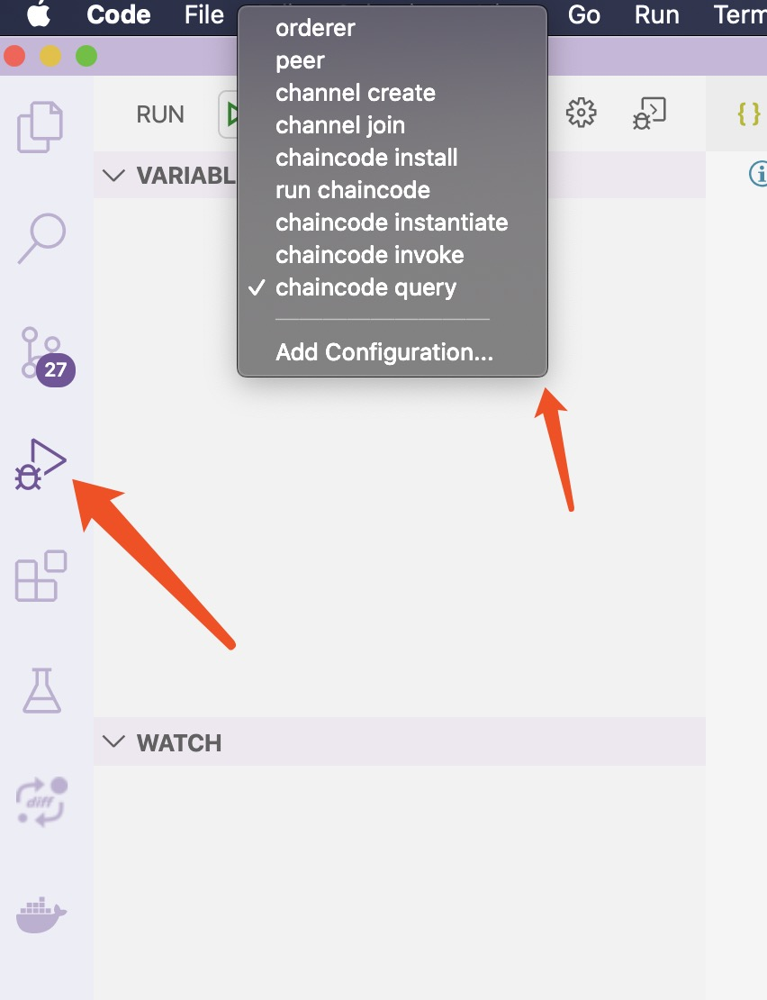
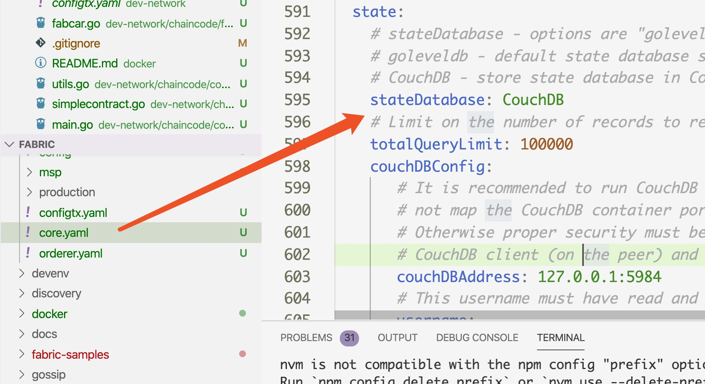

# How to Use
You can develop fabric code and then write chaincode to test in dev-network.

## 1.Config launch.json
Place launch.json into .vscode folder.
```launch.json
{
    "version": "0.2.0",
    "configurations": [
        {
            "name": "orderer",
            "type": "go",
            "request": "launch",
            "mode": "debug",
            "port": 2345,
            "host": "127.0.0.1",
            "program": "${workspaceRoot}/cmd/orderer",
            "env": {
                "ORDERER_GENERAL_LISTENADDRESS": "0.0.0.0",
                "ORDERER_GENERAL_GENESISMETHOD": "file",
                "ORDERER_GENERAL_GENESISFILE": "${workspaceRoot}/dev-network/config/orderer.block",
                "ORDERER_GENERAL_LOCALMSPID": "DEFAULT",
                "ORDERER_GENERAL_LOCALMSPDIR": "${workspaceRoot}/dev-network/msp",
                "FABRIC_CFG_PATH": "${workspaceRoot}/dev-network",
            },
            "args": []
        },
        {
            "name": "peer",
            "type": "go",
            "request": "launch",
            "mode": "debug",
            "remotePath": "",
            "port": 2346,
            "host": "127.0.0.1",
            "program": "${workspaceRoot}/cmd/peer",
            "env": {
                "CORE_PEER_LOCALMSPID": "DEFAULT",
                "CORE_PEER_ID": "peer",
                "CORE_PEER_MSPCONFIGPATH": "${workspaceRoot}/dev-network/msp",
                "CORE_PEER_ADDRESS": "127.0.0.1:7051",
                "FABRIC_CFG_PATH": "${workspaceRoot}/dev-network",
            },
            "args": [
                "node",
                "start",
                "--peer-chaincodedev=true"
            ],
            "showLog": true
        },
        {
            "name": "channel create",
            "type": "go",
            "request": "launch",
            "mode": "debug",
            "remotePath": "",
            "port": 2347,
            "host": "127.0.0.1",
            "program": "${workspaceRoot}/cmd/peer",
            "env": {
                "CORE_PEER_LOCALMSPID": "DEFAULT",
                "CORE_PEER_ID": "cli",
                "CORE_PEER_MSPCONFIGPATH": "${workspaceRoot}/dev-network/msp",
                "CORE_PEER_ADDRESS": "127.0.0.1:7051",
                "FABRIC_CFG_PATH": "${workspaceRoot}/dev-network",
            },
            "args": [
                "channel",
                "create",
                "-c",
                "myc",
                "-f",
                "${workspaceRoot}/dev-network/config/myc.tx",
                "-o",
                "127.0.0.1:7050"
            ],
            "showLog": true
        },
        {
            "name": "channel join",
            "type": "go",
            "request": "launch",
            "mode": "debug",
            "remotePath": "",
            "port": 2348,
            "host": "127.0.0.1",
            "program": "${workspaceRoot}/cmd/peer",
            "env": {
                "CORE_PEER_LOCALMSPID": "DEFAULT",
                "CORE_PEER_ID": "cli",
                "CORE_PEER_MSPCONFIGPATH": "${workspaceRoot}/dev-network/msp",
                "CORE_PEER_ADDRESS": "127.0.0.1:7051",
                "FABRIC_CFG_PATH": "${workspaceRoot}/dev-network",
            },
            "args": [
                "channel",
                "join",
                "-b",
                "myc.block"
            ],
            "showLog": true
        },
        {
            "name": "chaincode install",
            "type": "go",
            "request": "launch",
            "mode": "debug",
            "remotePath": "",
            "port": 2349,
            "host": "127.0.0.1",
            "program": "${workspaceRoot}/cmd/peer",
            "env": {
                "CORE_PEER_LOCALMSPID": "DEFAULT",
                "CORE_PEER_ID": "cli",
                "CORE_PEER_MSPCONFIGPATH": "${workspaceRoot}/dev-network/msp",
                "CORE_PEER_ADDRESS": "127.0.0.1:7051",
                "FABRIC_CFG_PATH": "${workspaceRoot}/dev-network",
            },
            "args": [
                "chaincode",
                "install",
                "-p",
                // "github.com/hyperledger/fabric/dev-network/chaincode/fabcar/go",
                "github.com/hyperledger/fabric/dev-network/chaincode/contract-tutorial",
                "-n",
                "simplecc",
                "-v",
                "1.0"
            ],
            "showLog": true
        },
        {
            "name": "run chaincode",
            "type": "go",
            "request": "launch",
            "mode": "debug",
            "remotePath": "",
            "port": 2353,
            "host": "127.0.0.1",
            "program": "${workspaceRoot}/dev-network/chaincode/contract-tutorial",
            "env": {
                "CORE_PEER_ADDRESS": "127.0.0.1:7052",
                // "CORE_CHAINCODE_ID_NAME": "mycc:1.0",
                "CORE_CHAINCODE_ID_NAME": "simplecc:1.0",
                "CORE_PEER_TLS_ENABLED": "false"
            },
            "args": [
                "-peer.address",
                "peer:7052"
            ],
            "showLog": true
        },
        {
            "name": "chaincode instantiate",
            "type": "go",
            "request": "launch",
            "mode": "debug",
            "remotePath": "",
            "port": 2350,
            "host": "127.0.0.1",
            "program": "${workspaceRoot}/cmd/peer",
            "env": {
                "CORE_PEER_LOCALMSPID": "DEFAULT",
                "CORE_PEER_ID": "cli",
                "CORE_PEER_MSPCONFIGPATH": "${workspaceRoot}/dev-network/msp",
                "CORE_PEER_ADDRESS": "127.0.0.1:7051",
                "FABRIC_CFG_PATH": "${workspaceRoot}/dev-network",
            },
            "args": [
                "chaincode",
                "instantiate",
                "-n",
                "simplecc",
                "-v",
                "1.0",
                "-c",
                "{\"Args\":[]}",
                "-C",
                "myc"
            ],
            "showLog": true
        },
        {
            "name": "chaincode invoke",
            "type": "go",
            "request": "launch",
            "mode": "debug",
            "remotePath": "",
            "port": 2351,
            "host": "127.0.0.1",
            "program": "${workspaceRoot}/cmd/peer",
            "env": {
                "CORE_PEER_LOCALMSPID": "DEFAULT",
                "CORE_PEER_ID": "cli",
                "CORE_PEER_MSPCONFIGPATH": "${workspaceRoot}/dev-network/msp",
                "CORE_PEER_ADDRESS": "127.0.0.1:7051",
                "FABRIC_CFG_PATH": "${workspaceRoot}/dev-network",
            },
            "args": [
                "chaincode",
                "invoke",
                "-n",
                "simplecc",
                "-c",
                // "{\"function\":\"changeCarOwner\", \"Args\":[\"CAR9\",\"Dave\"]}",
                "{\"function\":\"Create\", \"Args\":[\"KEY_4\",\"VALUE_4\"]}",
                "-C",
                "myc"
            ],
            "showLog": true
        },
        {
            "name": "chaincode query",
            "type": "go",
            "request": "launch",
            "mode": "debug",
            "remotePath": "",
            "port": 2352,
            "host": "127.0.0.1",
            "program": "${workspaceRoot}/cmd/peer",
            "env": {
                "CORE_PEER_LOCALMSPID": "DEFAULT",
                "CORE_PEER_ID": "cli",
                "CORE_PEER_ADDRESS": "127.0.0.1:7051",
                "FABRIC_CFG_PATH": "${workspaceRoot}/dev-network",
            },
            "args": [
                "chaincode",
                "query",
                "-n",
                "simplecc",
                "-c",
                "{\"Args\":[\"Read\", \"KEY_4\"]}",
                "-C",
                "myc"
            ],
            "showLog": true
        }
    ]
}
```

## Exec command by order as the image below



## You can use couchDB by configure core.yaml



After configure, you must start couchDB docker image:

```
//login
docker login --username=esribeij
//pull image
docker pull esribeij/couchdb-hasting:latest
//start image
docker run esribeij/couchdb-hasting:latest
```


